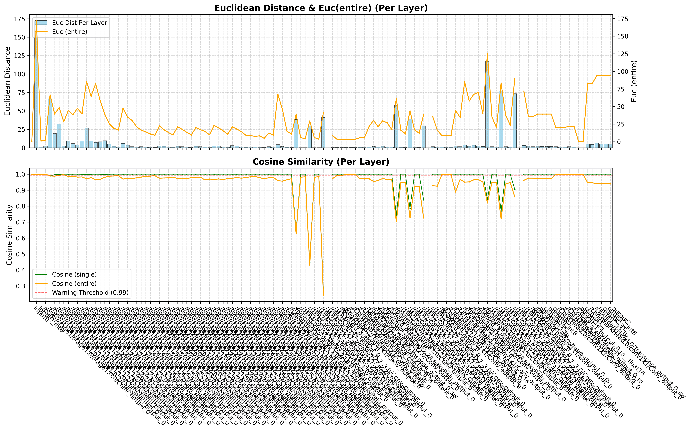
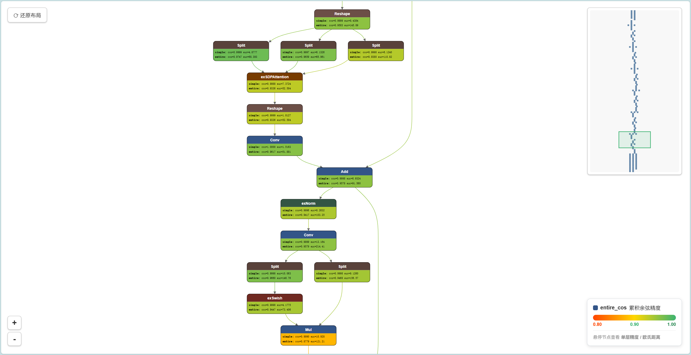
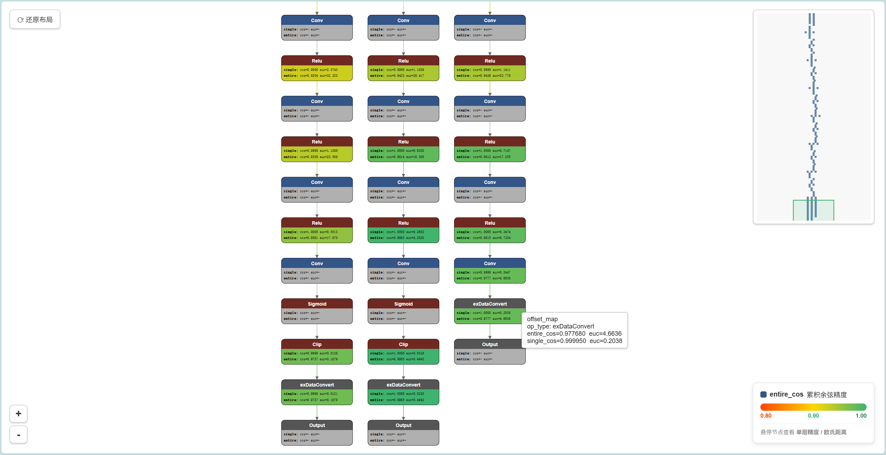

# 📊 量化精度分析指南

## 📖 概述

模型量化（INT8/INT4）虽然能大幅降低模型体积和推理延迟，但不可避免地会引入精度损失。<br>
**精度分析**的作用是：对同一张输入图片，逐层对比 **浮点模型（Golden）** 与 **量化模型（Quantized）** 的中间张量输出，以定位量化损失最大的层，为后续优化（混合量化、调整量化算法、校准数据集优化等）提供数据依据。

本工具链为 **RKNN** 和 **QNN** 两条转换路径均提供了精度分析能力：

| 转换工具 | 精度分析引擎 | 在本工具链的构造 | 触发方式 |
|---------|------------|---------|---------|
| `OnnxToRKNN` | RKNN Toolkit2 内置的 `rknn.accuracy_analysis()` | 直接调用 RKNN Toolkit2 内置的 `rknn.accuracy_analysis()` | 调用转换工具示例的方法 `set_do_accuracy_analysis()` 并传入图片 |
| `OnnxToQNN` | QAIRT `snpe-accuracy-debugger` | 脚本多步骤调用 `snpe-accuracy-debugger` | 调用转换工具示例的方法 `set_do_accuracy_analysis()` 并传入图片 |

### 关注的指标

精度分析围绕两个核心指标评估量化损失：

| 指标 | 含义 | 判断方向 |
|------|------|------|
| **余弦相似度**<br> Cosine Similarity | 衡量两个张量在**方向**上的相似程度，范围 [0, 1]，1 表示完全一致 | 越接近 1 越好，< 0.99 需关注 |
| **欧几里得距离**<br> Euclidean Distance(L2 Distance) | 衡量两个张量在**数值大小**上的绝对差异 | 越小越好，突增处即为问题层 |

> 两者结合使用：余弦相似度对方向敏感、不受数值缩放影响；<br>
> 欧氏距离反映绝对量级差异。某层余弦相似度高但欧氏距离大，通常是合理的数值缩放（如量化引入的均匀缩放因子）；<br>
> 两者同时恶化则说明该层量化损失严重。

---

## 🎯 1. RKNN 精度分析

### 1.1 接口调用

在 `OnnxToRKNN` 转换脚本中，调用 `set_do_accuracy_analysis()` 传入用于精度分析的图片路径：

```python
from utilities.onnx_to_rknn import OnnxToRKNN

converter = OnnxToRKNN(
    model_path=MODEL_PATH,
    rknn_model_path=RKNN_MODEL,
    dataset_path=DATASET,
    target_platform='rk3588'
)

# 启用精度分析（传入一张或多张图片）
converter.set_do_accuracy_analysis(
    accuracy_analysis_picture_list=[
        '/path/to/test_image.jpg'
    ]
)

converter.convert(mean_rgb=[[0, 0, 0]], std_rgb=[[255, 255, 255]])
converter.clean()
```

> **注意：** 
> - 单输入模型传入一个图片路径；多输入模型按输入数量传入多个路径。
> - `accuracy_analysis_picture_list` 中的图片**建议不被包含在量化校准数据中**，而是专门用于精度评测，以确保评估的独立性 (包含在也不是不行)。
> - 需在 `convert()` **之前**调用；若未调用或传入 `None`，精度分析将被跳过，不影响正常转换。


### 1.2 分析流程

RKNN 精度分析主要由 RKNN Toolkit2 内置的 `rknn.accuracy_analysis()` 完成：

```
RKNN Toolkit2 内置的 `rknn.accuracy_analysis()` 自动执行
```

然后它生成的**结论**会被绘制成 matplotlib 图表<br>
它生成的**数据**会被 `utilities/accuracy_debugger.py` 里的 `RknnAccuracyDebugger` 进行进一步的解析来绘制整个网络的精度追踪图。

### 1.3 输出文件

分析完成后，结果文件位于 `utilities/tmp/snapshot/` 下：

| 目录/文件 | 说明 |
|----------|------|
| `utilities/tmp/snapshot/golden/` | Golden（浮点）模型逐层中间张量（`.npy` 文件） |
| `utilities/tmp/snapshot/simulator/` | Simulator（量化）模型逐层中间张量（`.npy` 文件） |
| `utilities/tmp/snapshot/error_analysis.txt` | 完整逐层精度对比表（全部层数据） |
| `utilities/tmp/snapshot/map_name_to_file.txt` | 层名与中间张量文件的映射表 |
| `utilities/tmp/rknn_accuracy_analysis_summary.png` | 可视化汇总图表（调用 `plot_accuracy_analysis()` 生成，见[1.5](#15-可视化图表解读)） |
| `utilities/tmp/rknn_graph_accuracy_analysis.html` | 可视化计算图精度分析 |

> 📁 以上文件在调用 `clean()` 清理前均可查阅。


### 1.4 终端输出解读
RKNN 精度分析会逐层对比浮点模型（Golden）与量化模型（Simulator）的输出，输出格式如下：

```
I AccuracyAnalysing : 100%|███████████████████████████████████████| 127/127 [00:28<00:00,  4.53it/s]

# simulator_error: calculate the output error of each layer of the simulator (compared to the 'golden' value).
#              entire: output error of each layer between 'golden' and 'simulator', these errors will accumulate layer by layer.
#              single: single-layer output error between 'golden' and 'simulator', can better reflect the single-layer accuracy of the simulator.

layer_name                                                                   simulator_error
                                                                         entire              single
                                                                      cos      euc        cos      euc
------------------------------------------------------------------------------------------------------------
[Input] input0                                                      1.00000 | 0.0       1.00000 | 0.0
[exDataConvert] input0_int8                                         1.00000 | 0.0       1.00000 | 0.0
[Conv] /body/stage1/stage1.0/stage1.0.0/Conv_output_0               1.00000 | 0.4718    1.00000 | 0.4718
[LeakyRelu] /body/stage1/stage1.0/stage1.0.2/LeakyRelu_output_0     1.00000 | 2.4762    1.00000 | 2.4698
[Conv] /body/stage1/stage1.1/stage1.1.0/Conv_output_0               0.99430 | 39.532    0.99432 | 39.498
[LeakyRelu] /body/stage1/stage1.1/stage1.1.2/LeakyRelu_output_0     0.99813 | 16.433    0.99958 | 7.6623
[Conv] /body/stage1/stage1.1/stage1.1.3/Conv_output_0               0.99814 | 22.192    0.99992 | 4.4927
[LeakyRelu] /body/stage1/stage1.1/stage1.1.5/LeakyRelu_output_0     0.99746 | 19.323    0.99996 | 2.7927
...（中间层省略）...
[Conv] /ssh3/conv3X3/conv3X3.0/Conv_output_0                        0.76226 | 34.169    0.77435 | 33.401      <-- ⚠️ entire cos 偏低
[Conv] /ssh3/conv5X5_2/conv5X5_2.0/Conv_output_0                    0.70669 | 26.507    0.71369 | 26.225      <-- ⚠️ single cos 也已偏低
...（中间层省略）...
[Conv] /ssh1/conv3X3/conv3X3.0/Conv_output_0                        0.74489 | 135.43    0.78992 | 124.20
[Conv] /ssh1/conv5X5_2/conv5X5_2.0/Conv_output_0                    0.62190 | 117.09    0.69730 | 106.79      <-- ❌ 严重损失
[Conv] /ssh1/conv7x7_3/conv7x7_3.0/Conv_output_0                    0.64429 | 121.29    0.74632 | 104.17      <-- ❌ 严重损失
...（后续层省略）...
[Conv] /ClassHead.0/conv1x1/Conv_output_0                           0.99765 | 20.991    0.99999 | 1.3997
[exSoftmax13] output1-rs                                            0.99999 | 0.2996    1.00000 | 0.0093
[Conv] /LandmarkHead.0/conv1x1/Conv_output_0                        0.92500 | 101.12    0.99985 | 4.4679
I The error analysis results save to: ./snapshot/error_analysis.txt
```

**指标说明：**（余弦相似度与欧氏距离的基本含义见[概述 · 关注的指标](#关注的指标)）

| 指标 | 含义 | 用途 |
|------|------|------|
| `entire cos` | 累积余弦相似度（从输入到当前层的累计误差） | 反映误差**逐层累积**后的影响，值越低说明前面某层已引入较大偏差 |
| `single cos` | 单层余弦相似度（仅当前层自身的量化误差） | 反映**该层本身**的量化精度，更适合定位具体问题层 |
| `euc` | 欧氏距离 | 辅助指标，与 cos 结合判断量化误差的量级 |


### 1.5 可视化图表解读
#### 1.5.1 统计图表

精度分析完成后会自动读取 `utilities/tmp/snapshot/error_analysis.txt` 并生成可视化汇总图（指标含义参见[概述 · 关注的指标](#关注的指标)），默认保存为 `utilities/tmp/rknn_accuracy_analysis_summary.png`：



`rknn_accuracy_analysis_summary.png` 包含两个子图（布局与 QNN 精度分析保持一致）：

**上图 — 欧氏距离（Euclidean Distance）（逐层柱状图 + 折线图）**
- 天蓝色柱状图：每层的**单层**欧氏距离（`single euc`），柱子突出的层即为单层量化损失最大的层
- 橙色折线（右轴）：每层的**累积**欧氏距离（`entire euc`），反映误差逐层累积后的绝对量级

**下图 — 余弦相似度（Cosine Similarity）（逐层折线图）**
- 绿色折线：每层的**单层**余弦相似度（`single cos`），**低于红线的层需重点关注**
- 橙色折线：每层的**累积**余弦相似度（`entire cos`），反映误差逐层累积的影响
- 红色虚线：0.99 警戒阈值（对于 INT8 量化，0.9 以上通常可接受）

> 💡 结合上图突出的柱与下图跌破红线的层，即可圈定量化损失最大的层，作为混合量化的候选层清单（见[4.2 分析后的优化路径](#42-分析后的优化路径)）。

#### 1.5.2 计算图精度可视化

除统计图表外，精度分析还会自动生成 **Netron 风格的可视化计算图**（`utilities/tmp/rknn_graph_accuracy_analysis.html`），以 DAG 形式呈现整个网络并按累积精度着色，便于观察误差沿数据流的传播路径。详见 [3. 可视化计算图精度分析](#3-可视化计算图精度分析)。

---

## 🎯 2. QNN 精度分析

### 2.1 使用方法

在 `OnnxToQNN` 转换脚本中，调用 `set_do_accuracy_analysis()` 传入用于精度分析的图片路径：

```python
from utilities.onnx_to_qnn import OnnxToQNN

converter = OnnxToQNN(
    model_path=MODEL_PATH,
    qnn_model_path=QNN_MODEL,
    dataset_path=DATASET,
    target_platform='qcs6490'
)

# 启用精度分析（传入一张或多张图片）
converter.set_do_accuracy_analysis(
    accuracy_analysis_picture_list=[
        str(parent_dir / 'datasets/test_image.jpg')
    ]
)

converter.convert(mean_rgb=[[0, 0, 0]], std_rgb=[[1, 1, 1]])
```

> **注意：** 
> - 单输入模型传入一个图片路径；多输入模型按输入数量传入多个路径。
> - `accuracy_analysis_picture_list` 中的图片**建议不被包含在量化校准数据中**，以确保评估的独立性。
> - 需在 `convert()` **之前**调用；若未调用，精度分析将被跳过，不影响正常转换。

### 2.2 分析流程

QNN 精度分析自动执行以下三步（**Step 1 与 Step 2 并行执行**，两者互不依赖）：

```
┌──────────────────────────────────────────────────────────┐
│  Step 1: Golden 推理        ┐                             │
│  使用 snpe-accuracy-debugger │ 并行                       │
│  在未量化的 DLC 模型上推理    ├──────────────────────────── │
│  得到各层浮点参考输出         │                             │
├──────────────────────────────────────────────────────────┤
│  Step 2: Quantized 推理     ┘                             │
│  使用 snpe-accuracy-debugger 在量化后的 DLC 模型上推理     │
│  得到各层量化输出 (Inference Results)                      │
├──────────────────────────────────────────────────────────┤
│  Step 3: Verification 对比                                │
│  逐层计算 CosineSimilarity + MSE                          │
│  生成 summary.csv 和可视化图表                             │
└──────────────────────────────────────────────────────────┘
```

### 2.3 输出文件

> **关于工作目录的说明：** 高通 `snpe-accuracy-debugger` 在精度分析过程中会在工作目录下创建**文件链接（symlink）**。<br>
> 由于部分文件系统（如 Windows 的 NTFS、网络共享挂载等）不支持符号链接，本工具暂时使用用户主目录 `~/accuracy_analysis/` 作为临时工作目录。<br>
> 分析完成后，所有结果会自动**拷贝到 `utilities/tmp/accuracy_analysis/`**，随后删除 `~/accuracy_analysis/` 临时目录。

分析完成后，最终输出文件位于 `utilities/tmp/` 下：

| 目录/文件 | 说明 |
|----------|------|
| `utilities/tmp/accuracy_analysis/golden_dir/` | Golden（浮点）模型逐层推理结果 |
| `utilities/tmp/accuracy_analysis/quant_dir/` | Quantized（量化）模型逐层推理结果 |
| `utilities/tmp/accuracy_analysis/verification/summary.csv` | 逐层精度对比表 |
| `utilities/tmp/accuracy_analysis_summary.png` | 可视化汇总图表（见[2.4](#24-可视化图表解读)） |
| `utilities/tmp/qnn_graph_accuracy_analysis.html` | 可视化计算图精度分析（见[3](#3-可视化计算图精度分析)） |

> 📁 以上文件在调用 `clean()` 清理前均可查阅。

### 2.4 可视化图表解读

`accuracy_analysis_summary.png` 包含两个子图（指标含义参见[概述 · 关注的指标](#关注的指标)）：

**上图 — 欧氏距离（Euclidean Distance）& MSE（逐层柱状图 + 折线图）**
- 柱状图：每层的欧氏距离，**柱子突出的层即为量化损失最大的层**
- 蓝色折线（右轴）：每层的 MSE，与欧氏距离结合可判断误差的真假阳性

**下图 — 余弦相似度（Cosine Similarity）（逐层折线图）**
- 绿色折线：每层的余弦相似度，**低于红线的层需重点关注**
- 红色虚线：0.99 警戒阈值（对于 INT8 量化，0.9 以上通常可接受）

> ⚠️ **关于 "lost" 层：** QNN 通过文件名相似度匹配 Golden 与 Quantized 的逐层输出，**无法匹配（名称相似度 < 0.8 或张量尺寸不一致）的层会被标记为 "lost" 并排除在统计之外**，绘图时会在终端打印 `LOST PAIRS` 清单。这类层通常是图优化中被融合/消除的节点，一般可忽略；若数量异常多则需检查模型转换是否异常。


### 2.5 计算图精度可视化

除统计图表外，精度分析还会自动生成 **Netron 风格的可视化计算图**（`utilities/tmp/qnn_graph_accuracy_analysis.html`），以 DAG 形式呈现整个网络并按累积精度着色，便于观察误差沿数据流的传播路径。详见 [3. 可视化计算图精度分析](#3-可视化计算图精度分析)。


## 3. 可视化计算图精度分析

逐层柱状图/折线图（见 [1.5](#15-可视化图表解读)、[2.4](#24-可视化图表解读)）适合定位"哪一层精度差"，但无法直观看出**误差在整张网络中如何沿数据流传播**。为此，工具链额外提供 **Netron 风格的可视化计算图**，把整个网络以"方框节点 + 箭头连线"的 DAG 呈现，并按**累积精度**着色，一眼即可看出精度损失从哪一层开始、向哪些下游扩散。

该能力由 `utilities/accuracy_debugger.py` 中的 `AccuracyGraph` 类实现，**RKNN 与 QNN 两条路径共用同一套渲染逻辑**，仅数据来源不同：

| 转换路径 | 数据源 | 触发入口 | 输出文件 |
|---------|--------|---------|---------|
| RKNN | `RknnAccuracyDebugger.read_path_analysis()` | `plot_network_analysis(show=True)` | `rknn_graph_accuracy_analysis.html` |
| QNN | `SnpeAccuracyDebugger` 解析结果 | `plot_network_analysis(...)` | `qnn_graph_accuracy_analysis.html` |

### 3.1 触发方式

**方式一：随转换自动触发。** 在转换脚本中启用精度分析（`set_do_accuracy_analysis()`）后，`convert()` 完成精度分析时会**自动**调用 `plot_network_analysis(show=True)`，在浏览器中弹出计算图：

```python
converter.set_do_accuracy_analysis(accuracy_analysis_picture_list=[IMG])
converter.convert(...)   # 精度分析结束后自动弹出计算图 HTML
```

**方式二：独立调用。** 转换完成后，可直接构造调试器对象单独渲染（无需重新转换），便于反复查看或调整：

```python
from utilities.accuracy_debugger import RknnAccuracyDebugger

debugger = RknnAccuracyDebugger(tmp_dir, tmp_model_path)
debugger.plot_network_analysis(show=True)   # QNN 侧对应 SnpeAccuracyDebugger
```

### 3.2 图形解读



- **节点（方框）**：每个网络层一个节点，边框颜色按**算子类型**区分（Netron 色板：卷积/全连接、激活、池化、归一化、Tensor、量化层等）。
- **节点填充色**：按**累积余弦精度 `entire_cos`** 着色 —— **红 = 差、黄 = 中、绿 = 良**（映射区间 0.80~1.00）。某节点变红，说明从输入到该层的累积精度已明显下降。
- **连线（箭头）**：数据流方向，采用 Netron 风格漂浮贝塞尔曲线，跨多层长边会自动插入虚拟节点绕行，避免连线绕到图外。
- **悬停节点**：显示该层的**单层精度（single_cos）与欧氏距离（single_euc）** 等详细信息，用于区分"本层引入的误差"与"上游累积的误差"。
- **Input / Output 终端节点**：图首尾自动追加示意节点（Input 无精度数据，Output 仅示意，不替换原层）。

> **判读技巧：** 沿数据流找**第一个由绿转红的节点**，即为量化损失的主要来源层；若某节点本身单层精度尚可、但填充色已红，说明误差来自上游，应继续向上追溯。

### 3.3 交互操作

输出为**自包含 SVG + 内联 JS 的 HTML**（无外部依赖，可直接用浏览器打开）：

- **缩放 / 平移**：滚轮缩放、拖拽平移，或 `WASD` 键移动；左下角 `+` / `-` 按钮缩放。
- **还原布局**：左上角 `↺ 还原布局` 按钮回到初始视图。
- **小地图（minimap）**：右下角缩略图实时显示当前视口在全图中的位置，可点击跳转。
- **图例**：右上角颜色条标注 `entire_cos` 累积精度对应的红-黄-绿区间。


### 3.4 典型分析场景

**① 区分多输出网络各输出的精度。** 对于检测/分割/多任务等**多输出网络**，逐层图表只能给出一个整体序列，难以分辨"到底是哪一路输出精度差"。可视化计算图把每个 **Output 终端节点**独立呈现并各自着色，可**直接对比各输出分支的累积精度**——哪一路输出节点偏红，就说明该任务/分支的量化损失更大，从而针对性地对该分支做混合量化或校准优化，而非笼统地处理整网。



**② 分析量化器对上游误差的"修复"。** 量化器（Quantize/Dequantize 节点）不仅会引入误差，其**取整/缩放行为有时也能"吸收"上游累积的微小误差**，使下游某层的累积精度反而回升。在计算图中，这种"先变红、下游又转绿"的**精度回升**会直观地体现在节点填充色上：若某量化器下游节点由红转绿，说明该量化器对上游误差起到了修复/抑制作用。这一现象在纯数值表格中不易察觉，而在着色计算图中一目了然，有助于判断哪些量化器是"误差源"、哪些是"误差缓冲"，为混合量化时保留/裁剪子图提供依据。

---

## 💡 4. 精度分析最佳实践

### 4.1 图片选择

- 选择**模型实际应用场景中具有代表性**的图片
- **一次精度分析只使用一组图片**（每个输入节点对应一张图片，单输入模型传 1 张，多输入模型按输入数量传多张）
- 精度分析图片应**不**包含在量化校准数据集中，保证评估的客观性

### 4.2 分析后的优化路径

| 发现的问题 | 建议的优化方案 |
|-----------|--------------|
| 整体余弦相似度（Cosine Similarity）偏低（< 0.95） | ① 更换量化算法（如 `entropy` → `kl_divergence`）<br>② 扩充/替换量化校准数据集 |
| 仅个别层余弦相似度（Cosine Similarity）偏低 | 对该层/子图做**混合量化**（QNN：16-bit 整数子图或 FP16/FP32 浮点子图，RKNN：FP16 子图，详见 [TOOLUSE.md → 3.4 混合量化](./TOOLUSE.md#34-混合量化)） |
| 某些层欧氏距离（Euclidean Distance）特别大 | 检查该层是否为激活函数层（如 Sigmoid/Softmax），<br>此类层对量化敏感，建议混合量化 |
| QNN 中某些层 Name 显示为 "lost" | 该层在 Golden 和 Quant 模型间无法匹配，<br>可能是图优化过程中被融合或消除，通常可忽略 |

---


## ⚠️ 5. 注意事项

1. **RKNN 和 QNN 相关工具 (如精度分析) 仅支持 Linux 环境** 。
2. **如果未设置 `accuracy_analysis_picture_list` 或设为 `None`** — 精度分析将被跳过，不影响正常转换流程。
3. **精度分析会增加转换时间** — 需要对同一输入在未量化和量化模型上分别做一次完整推理，耗时为正常转换的 2~3 倍。
4. **精度分析结果同时保存在 `utilities/tmp`** — 建议每次分析后保存此图表以便对比不同量化配置的效果。
5. **所有精度分析结果在调用 `clean()` 前均可查阅** — `clean()` 会清空 `utilities/tmp/` 下的临时文件，如需保留分析结果请在调用前手动备份。
