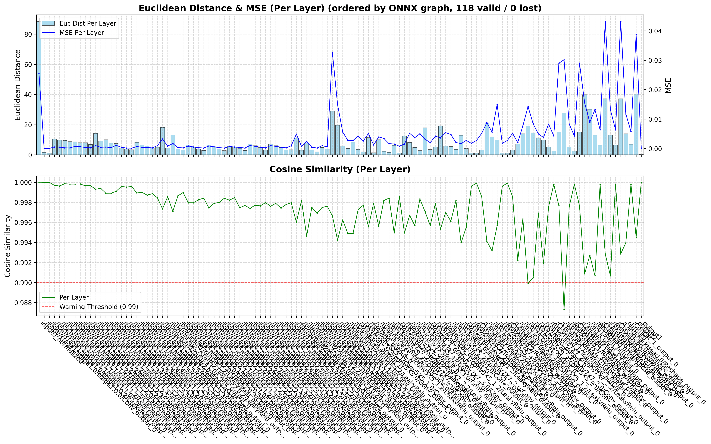

# 📊 量化精度分析指南

## 📖 概述

模型量化（INT8/INT4）虽然能大幅降低模型体积和推理延迟，但不可避免地会引入精度损失。<br>
**精度分析**的作用是：对同一张输入图片，逐层对比 **浮点模型（Golden）** 与 **量化模型（Quantized）** 的中间张量输出，以定位量化损失最大的层，为后续优化（混合量化、调整量化算法、校准数据集优化等）提供数据依据。

本工具链为 **RKNN** 和 **QNN** 两条转换路径均提供了精度分析能力：

| 转换工具 | 精度分析引擎 | 在本工具链的构造 | 触发方式 |
|---------|------------|---------|---------|
| `OnnxToRKNN` | RKNN Toolkit2 内置的 `rknn.accuracy_analysis()` | 直接调用 RKNN Toolkit2 内置的 `rknn.accuracy_analysis()` | 调用转换工具示例的方法 `set_do_accuracy_analysis()` 并传入图片 |
| `OnnxToQNN` | QAIRT `snpe-accuracy-debugger` | 脚本多步骤调用 `snpe-accuracy-debugger` | 调用转换工具示例的方法 `set_do_accuracy_analysis()` 并传入图片 |

### 关注的指标

精度分析围绕两个核心指标评估量化损失：

| 指标 | 含义 | 判断方向 |
|------|------|------|
| **余弦相似度**<br> Cosine Similarity | 衡量两个张量在**方向**上的相似程度，范围 [0, 1]，1 表示完全一致 | 越接近 1 越好，< 0.99 需关注 |
| **欧几里得距离**<br> Euclidean Distance(L2 Distance) | 衡量两个张量在**数值大小**上的绝对差异 | 越小越好，突增处即为问题层 |

> 两者结合使用：余弦相似度对方向敏感、不受数值缩放影响；<br>
> 欧氏距离反映绝对量级差异。某层余弦相似度高但欧氏距离大，通常是合理的数值缩放（如量化引入的均匀缩放因子）；<br>
> 两者同时恶化则说明该层量化损失严重。

---

## 🎯 1. RKNN 精度分析

### 1.1 使用方法

在 `OnnxToRKNN` 转换脚本中，调用 `set_do_accuracy_analysis()` 传入用于精度分析的图片路径：

```python
from utilities.onnx_to_rknn import OnnxToRKNN

converter = OnnxToRKNN(
    model_path=MODEL_PATH,
    rknn_model_path=RKNN_MODEL,
    dataset_path=DATASET,
    target_platform='rk3588'
)

# 启用精度分析（传入一张或多张图片）
converter.set_do_accuracy_analysis(
    accuracy_analysis_picture_list=[
        '/path/to/test_image.jpg'
    ]
)

converter.convert(mean_rgb=[[0, 0, 0]], std_rgb=[[255, 255, 255]])
converter.clean()
```

> **注意：** 
> - 单输入模型传入一个图片路径；多输入模型按输入数量传入多个路径。
> - `accuracy_analysis_picture_list` 中的图片将**不被包含在量化校准数据中**，而是专门用于精度评测，以确保评估的独立性。


### 1.2 分析流程

RKNN 精度分析由 RKNN Toolkit2 内置的 `rknn.accuracy_analysis()` 一步完成：

```
RKNN Toolkit2 内置的 `rknn.accuracy_analysis()` 自动执行
```

### 1.3 输出文件

分析完成后，结果文件位于 `utilities/tmp/snapshot/` 下：

| 目录/文件 | 说明 |
|----------|------|
| `utilities/tmp/snapshot/golden/` | Golden（浮点）模型逐层中间张量（`.npy` 文件） |
| `utilities/tmp/snapshot/simulator/` | Simulator（量化）模型逐层中间张量（`.npy` 文件） |
| `utilities/tmp/snapshot/error_analysis.txt` | 完整逐层精度对比表（全部层数据） |
| `utilities/tmp/snapshot/map_name_to_file.txt` | 层名与中间张量文件的映射表 |

> 📁 以上文件在调用 `clean()` 清理前均可查阅。


### 1.4 终端输出解读
RKNN 精度分析会逐层对比浮点模型（Golden）与量化模型（Simulator）的输出，输出格式如下：

```
I AccuracyAnalysing : 100%|███████████████████████████████████████| 127/127 [00:28<00:00,  4.53it/s]

# simulator_error: calculate the output error of each layer of the simulator (compared to the 'golden' value).
#              entire: output error of each layer between 'golden' and 'simulator', these errors will accumulate layer by layer.
#              single: single-layer output error between 'golden' and 'simulator', can better reflect the single-layer accuracy of the simulator.

layer_name                                                                   simulator_error
                                                                         entire              single
                                                                      cos      euc        cos      euc
------------------------------------------------------------------------------------------------------------
[Input] input0                                                      1.00000 | 0.0       1.00000 | 0.0
[exDataConvert] input0_int8                                         1.00000 | 0.0       1.00000 | 0.0
[Conv] /body/stage1/stage1.0/stage1.0.0/Conv_output_0               1.00000 | 0.4718    1.00000 | 0.4718
[LeakyRelu] /body/stage1/stage1.0/stage1.0.2/LeakyRelu_output_0     1.00000 | 2.4762    1.00000 | 2.4698
[Conv] /body/stage1/stage1.1/stage1.1.0/Conv_output_0               0.99430 | 39.532    0.99432 | 39.498
[LeakyRelu] /body/stage1/stage1.1/stage1.1.2/LeakyRelu_output_0     0.99813 | 16.433    0.99958 | 7.6623
[Conv] /body/stage1/stage1.1/stage1.1.3/Conv_output_0               0.99814 | 22.192    0.99992 | 4.4927
[LeakyRelu] /body/stage1/stage1.1/stage1.1.5/LeakyRelu_output_0     0.99746 | 19.323    0.99996 | 2.7927
...（中间层省略）...
[Conv] /ssh3/conv3X3/conv3X3.0/Conv_output_0                        0.76226 | 34.169    0.77435 | 33.401      <-- ⚠️ entire cos 偏低
[Conv] /ssh3/conv5X5_2/conv5X5_2.0/Conv_output_0                    0.70669 | 26.507    0.71369 | 26.225      <-- ⚠️ single cos 也已偏低
...（中间层省略）...
[Conv] /ssh1/conv3X3/conv3X3.0/Conv_output_0                        0.74489 | 135.43    0.78992 | 124.20
[Conv] /ssh1/conv5X5_2/conv5X5_2.0/Conv_output_0                    0.62190 | 117.09    0.69730 | 106.79      <-- ❌ 严重损失
[Conv] /ssh1/conv7x7_3/conv7x7_3.0/Conv_output_0                    0.64429 | 121.29    0.74632 | 104.17      <-- ❌ 严重损失
...（后续层省略）...
[Conv] /ClassHead.0/conv1x1/Conv_output_0                           0.99765 | 20.991    0.99999 | 1.3997
[exSoftmax13] output1-rs                                            0.99999 | 0.2996    1.00000 | 0.0093
[Conv] /LandmarkHead.0/conv1x1/Conv_output_0                        0.92500 | 101.12    0.99985 | 4.4679
I The error analysis results save to: ./snapshot/error_analysis.txt
```

**指标说明：**（余弦相似度与欧氏距离的基本含义见[概述 · 关注的指标](#关注的指标)）

| 指标 | 含义 | 用途 |
|------|------|------|
| `entire cos` | 累积余弦相似度（从输入到当前层的累计误差） | 反映误差**逐层累积**后的影响，值越低说明前面某层已引入较大偏差 |
| `single cos` | 单层余弦相似度（仅当前层自身的量化误差） | 反映**该层本身**的量化精度，更适合定位具体问题层 |
| `euc` | 欧氏距离 | 辅助指标，与 cos 结合判断量化误差的量级 |


### 1.5 混合量化优化

当精度分析发现特定层量化损失较大时，可使用混合量化将这些层保留为 FP16：

```python
# 对精度敏感的子图使用 FP16 量化
converter.do_hybrid_quantization(
    custom_hybrid=[
        ['敏感层(节点)的输入名', '敏感层(节点)的输出名'],
    ]
)
```

---

## 🎯 2. QNN 精度分析

### 2.1 使用方法

在 `OnnxToQNN` 转换脚本中，调用 `set_do_accuracy_analysis()` 传入用于精度分析的图片路径：

```python
from utilities.onnx_to_qnn import OnnxToQNN

converter = OnnxToQNN(
    model_path=MODEL_PATH,
    qnn_model_path=QNN_MODEL,
    dataset_path=DATASET,
    target_platform='qcs6490'
)

# 启用精度分析（传入一张或多张图片）
converter.set_do_accuracy_analysis(
    accuracy_analysis_picture_list=[
        str(parent_dir / 'datasets/test_image.jpg')
    ]
)

converter.convert(mean_rgb=[[0, 0, 0]], std_rgb=[[1, 1, 1]])
```

### 2.2 分析流程

QNN 精度分析自动执行以下三步：

```
┌──────────────────────────────────────────────────────────┐
│  Step 1: Golden 推理                                      │
│  使用 snpe-accuracy-debugger 在未量化的 DLC 模型上推理     │
│  得到各层浮点参考输出 (Golden Reference)                   │
├──────────────────────────────────────────────────────────┤
│  Step 2: Quantized 推理                                   │
│  使用 snpe-accuracy-debugger 在量化后的 DLC 模型上推理     │
│  得到各层量化输出 (Inference Results)                      │
├──────────────────────────────────────────────────────────┤
│  Step 3: Verification 对比                                │
│  逐层计算 CosineSimilarity + MSE                          │
│  生成 summary.csv 和可视化图表                             │
└──────────────────────────────────────────────────────────┘
```

### 2.3 输出文件

> **关于工作目录的说明：** 高通 `snpe-accuracy-debugger` 在精度分析过程中会在工作目录下创建**文件链接（symlink）**。<br>
> 由于部分文件系统（如 Windows 的 NTFS、网络共享挂载等）不支持符号链接，本工具暂时使用用户主目录 `~/accuracy_analysis/` 作为临时工作目录。<br>
> 分析完成后，所有结果会自动**拷贝到 `utilities/tmp/accuracy_analysis/`**，随后删除 `~/accuracy_analysis/` 临时目录。

分析完成后，最终输出文件位于 `utilities/tmp/` 下：

| 目录/文件 | 说明 |
|----------|------|
| `utilities/tmp/accuracy_analysis/golden_dir/` | Golden（浮点）模型逐层推理结果 |
| `utilities/tmp/accuracy_analysis/quant_dir/` | Quantized（量化）模型逐层推理结果 |
| `utilities/tmp/accuracy_analysis/verification/summary.csv` | 逐层精度对比表 |
| `utilities/tmp/accuracy_analysis_summary.png` | 可视化汇总图表 |

> 📁 以上文件在调用 `clean()` 清理前均可查阅。

### 2.4 可视化图表解读

`accuracy_analysis_summary.png` 包含两个子图（指标含义参见[概述 · 关注的指标](#关注的指标)）：

**上图 — 欧氏距离（Euclidean Distance）& MSE（逐层柱状图 + 折线图）**
- 柱状图：每层的欧氏距离，**柱子突出的层即为量化损失最大的层**
- 蓝色折线（右轴）：每层的 MSE，与欧氏距离结合可判断误差的真假阳性

**下图 — 余弦相似度（Cosine Similarity）（逐层折线图）**
- 绿色折线：每层的余弦相似度，**低于红线的层需重点关注**
- 红色虚线：0.99 警戒阈值（对于 INT8 量化，0.9 以上通常可接受）




### 2.5 QNN 混合量化优化

当精度分析发现特定层/子图损失较大时，可对这些子图使用混合量化（16-bit 整数或 FP16/FP32 浮点），其余部分仍保持全局 INT8：

```python
# 方式一：整数混合量化 —— 区域内 w8a16（权重 8bit，激活 16bit）
converter.do_hybrid_quantization(
    custom_hybrid=[
        ['敏感子图输入张量名', '敏感子图输出张量名'],
    ],
    weights_bitwidth=8,
    act_bitwidth=16,
    bias_bitwidth=8
)

# 方式二：浮点保留 —— 区域内保持 FP16
converter.do_hybrid_quantization(
    custom_hybrid=[
        ['敏感子图输入张量名', '敏感子图输出张量名'],
    ],
    float_bitwidth=16      # 16 = FP16 / 32 = FP32
)
```

> **注意：** 混合量化场景下，精度分析的 Golden 参考会自动改用**纯浮点 DLC**（`{模型名}_golden.dlc`）——带 16-bit 混合量化编码的未量化 DLC 无法在 x86 CPU 的 `--stage converted` 阶段运行（报 `No backend could validate`），会导致 Golden 输出无法生成、精度分析失败。转换工具会在开启混合量化时自动生成该浮点 DLC，无需手动干预。

---

## 💡 3. 精度分析最佳实践

### 3.1 图片选择

- 选择**模型实际应用场景中具有代表性**的图片
- **一次精度分析只使用一组图片**（每个输入节点对应一张图片，单输入模型传 1 张，多输入模型按输入数量传多张）
- 精度分析图片应**不**包含在量化校准数据集中，保证评估的客观性

### 3.2 分析后的优化路径

| 发现的问题 | 建议的优化方案 |
|-----------|--------------|
| 整体余弦相似度（Cosine Similarity）偏低（< 0.95） | ① 更换量化算法（如 `entropy` → `kl_divergence`）<br>② 扩充/替换量化校准数据集 |
| 仅个别层余弦相似度（Cosine Similarity）偏低 | 对该层/子图做**混合量化**（QNN：16-bit 整数子图或 FP16/FP32 浮点子图，见[2.5](#25-qnn-混合量化优化)；RKNN：FP16 子图，见[1.5](#15-混合量化优化)） |
| 某些层欧氏距离（Euclidean Distance）特别大 | 检查该层是否为激活函数层（如 Sigmoid/Softmax），<br>此类层对量化敏感，建议混合量化 |
| QNN 中某些层 Name 显示为 "lost" | 该层在 Golden 和 Quant 模型间无法匹配，<br>可能是图优化过程中被融合或消除，通常可忽略 |

---

## ⚠️ 4. 注意事项

1. **QNN 精度分析仅支持 Linux 环境** — 依赖 Qualcomm `snpe-accuracy-debugger` 工具，该工具仅提供 Linux x86_64 版本。
2. **RKNN 精度分析在 Windows 和 Linux 上均可使用** — 集成在 RKNN Toolkit2 中。
3. **精度分析会增加转换时间** — 需要对同一输入在未量化和量化模型上分别做一次完整推理，耗时为正常转换的 2~3 倍。
4. **如果未设置 `accuracy_analysis_picture_list` 或设为 `None`** — 精度分析将被跳过，不影响正常转换流程。
5. **QNN 精度分析结果同时保存在 `utilities/tmp/accuracy_analysis_summary.png`** — 建议每次分析后保存此图表以便对比不同量化配置的效果。
6. **所有精度分析结果在调用 `clean()` 前均可查阅** — `clean()` 会清空 `utilities/tmp/` 下的临时文件，如需保留分析结果请在调用前手动备份。
